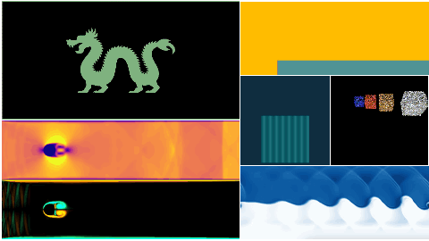
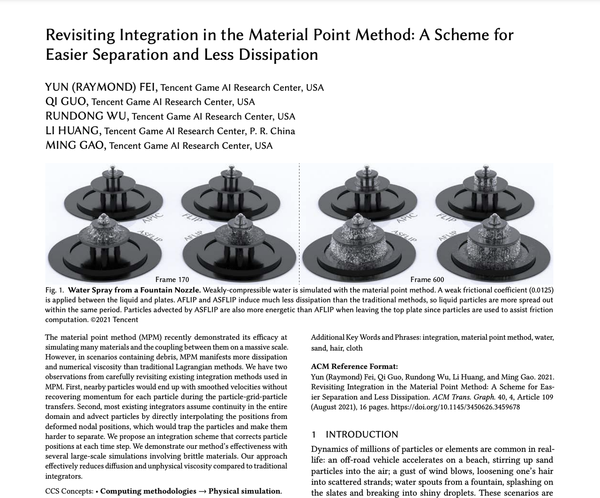
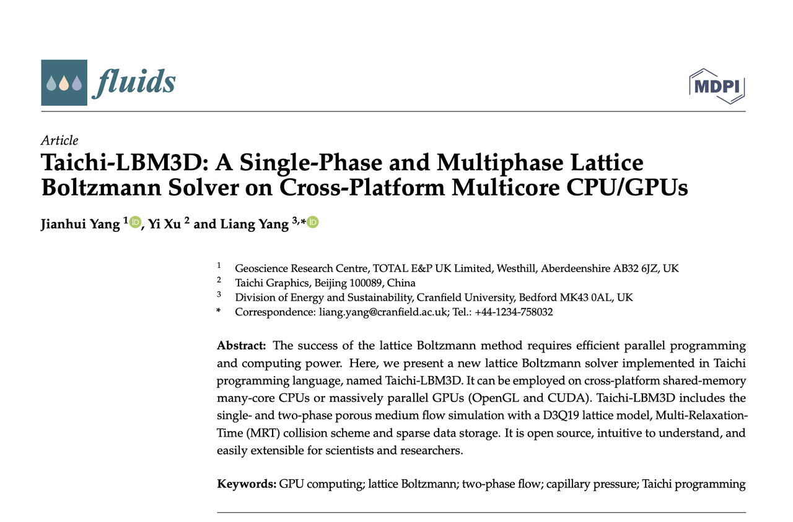
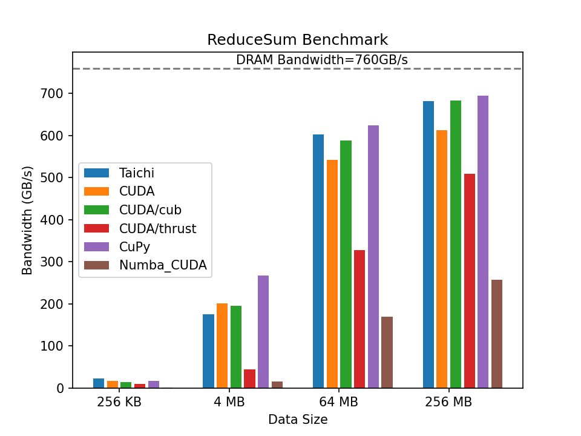
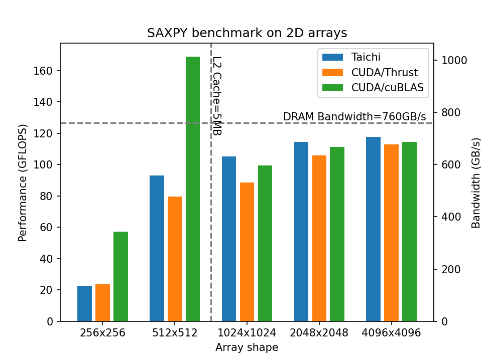
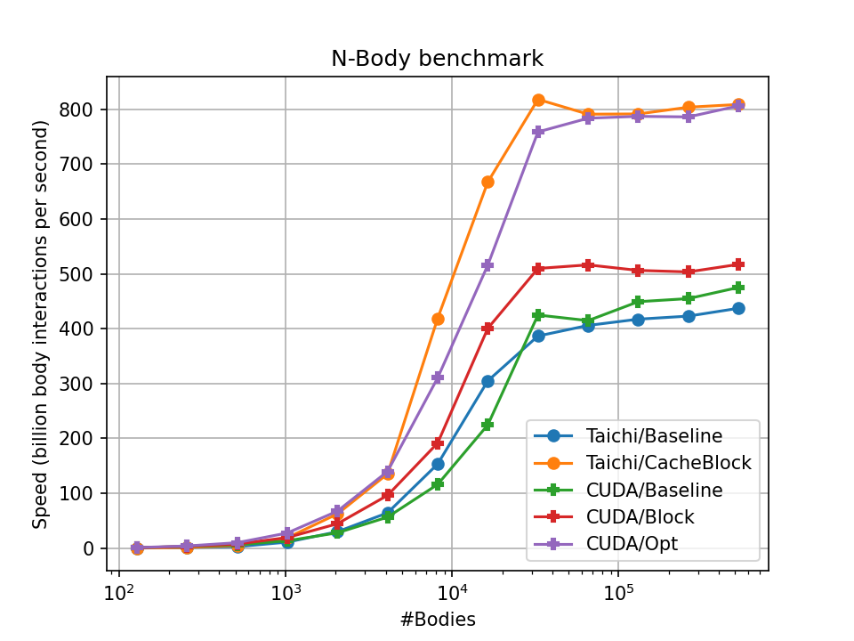
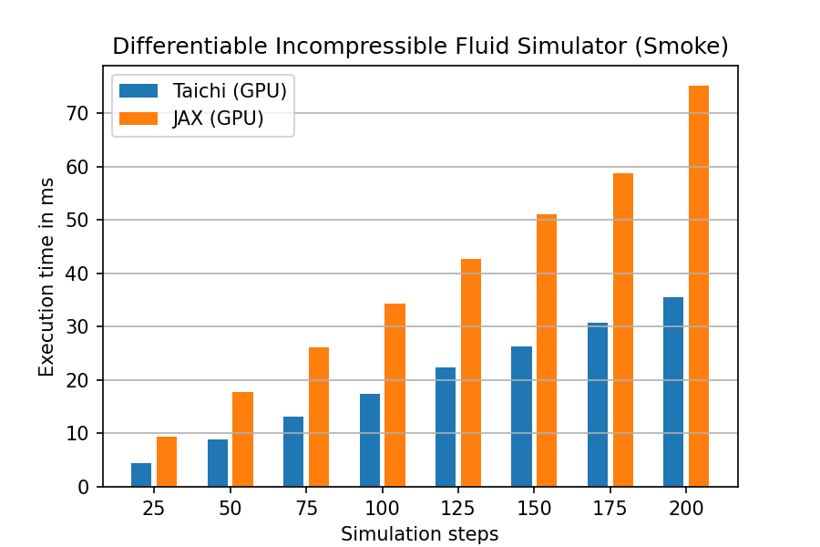

[](https://github.com/taichi-dev/taichi)
[](https://www.youtube.com/channel/UCu-k1Wglo9Ll_o2j5Bxl4cw)
[](https://twitter.com/taichigraphics)
[](https://www.zhihu.com/org/tai-ji-tu-xing)
[](https://space.bilibili.com/1779922645)

A collection of CFD related resources for Taichi developers.

## Contents
- [Introduction](#introduction)
- [Installation](#installation)
- [Why Taichi for numerical computation](#why-taichi-for-numerical-computation)
- [Benchmark](#benchmark)
- [Fluid simulation examples written in Taichi](#fluid-simulation-examples-written-in-taichi)
  - [Incompressible Fluids](#incompressible-fluids)
  - [Compressible Fluids](#compressible-fluids)
  - [Particle-Based Methods](#particle-based-methods)
  - [Computational Graphics](#computational-graphics)
  - [Fluid Engine](#fluid-engine)

## Introduction



[Taichi](https://github.com/taichi-dev/taichi) is an open source, high-performance parallel computing language embedded in Python. Compared to some traditional languages for numerical computation (Fortran/C++), Taichi offers the following advantages.

* Ease of use: Taichi's syntax is very similar to that of Python, minimizing the barrier to learning and writing parallel programs.

* Data structures: Taichi provides `ti.field` specifically designed for numerical computation, which decouples the computational code from the data structure, allowing users to flexibly debug the row-major order of data without modifying the computational logic.

At the same time, Taichi offers significant performance enhancements over familiar tools such as Matlab / Numpy for numerical computation users.

* Ultra-high performance: Taichi compiles user code into native CPU or GPU machine code using its proprietary JIT on-the-fly compilation technology, providing an order of magnitude performance improvement over interpreted languages

* Portability: Taichi runs on different backends (CPU, CUDA, Metal, OpenGL, etc.) and **no user** modification of the original code is required

These features make Taichi unmatched by other languages for the implementation of numerical computation algorithms, and more and more scholars/research groups are using Taichi as a tool language for algorithm implementation:




In addition, because Taichi is easy to install and has few additional dependencies, making it easier than ever for users to reproduce the code of others, we believe that Taichi will greatly facilitate academic and scientific communication among users of numerical computing.

## Installation

Taichi comes as a Python package, and it is as easy for users to install Taichi as it is to **install Python packages**, eliminating the need to toss around software dependencies. First make sure you have pip and have updated to the latest version: `

```
pip3 install pip --upgrade
```

Assuming you have Python version 3.0 or higher, you only need this **one command** to install Taichi.

```
pip3 install -U taichi
```
Then you can try to run the Taichi program! We provide a rich example of sample code

```
ti example
```

You can select the example you are interested in from the command line and enter the number to run it.

We have also recently added a more interactive ``gallery`` feature, which allows users to browse and select their favorite examples using the GUI interface

```
ti gallery
```


## Why Taichi for numerical computation

Taichi was originally created to resolve the conflict between programming efficiency and runtime performance for numerical computing users; to allow users to write **faster and more powerful** numerical computing programs with **less** code, Taichi offers the following features.

**Easy-to-use high-performance parallel computing**

Traditional parallel computing languages require more knowledge of the computer hardware and even require manual memory requests, memory releases (CUDA), manual allocation of scheduling thread blocks (Numba / CUDA), etc. during the code writing process. In Taichi, parallel computing code is almost as straightforward as serial code. For example, computing the 1st and 2nd order derivatives of a 1-dimensional variable with finite differences can be written in Taichi like this

```python
f = ti.field(dtype=ti.f64, shape=(128,))
dfdx = ti.field(dtype=ti.f64, shape=(128,))
d2fdx = ti.field(dtype=ti.f64, shape=(128,))
dx = 1e-3

@ti.kernel
def diff():
    for i in range(1,128):
        dfdx[i] = (f[i] - f[i-1]) / dx
    for i in range(1,127):
        d2fdx[i] = (f[i-1] - 2*f[i] + f[i+1]) / dx**2
```

Not only that, but in Taichi, users only need to modify one instruction at Taichi initialization to make their programs run on **multiple backends** such as multicore CPUs (e.g. x64, Arm) and GPUs (e.g. CUDA), without any concern for the underlying hardware changes: `` ` `

```python
ti.init(arch=ti.cpu) # Run on CPU backend
ti.init(arch=ti.cuda) # Run on CUDA backend
```

This is almost **impossible** in many existing tools. For example, Numba, which is popular among Python high performance computing users, requires users to write different code for the CPU and CUDA backends, where the CUDA backend code is written with a native interface very similar to CUDA, which is a large learning burden for numerical computing users and inconvenient for code maintenance.

For a comparison of Taichi and Numba / CUDA ease of use and performance benchmark, we have published a [technical blog](https://mp.weixin.qq.com/s/pu78S9JGGjelLf0xMmCspA) and a full [repository](https://github. com/taichi-dev/taichi_benchmark) for reference.

**Flexible Data Layout**

In numerical computing tasks, the memory arrangement of multidimensional arrays is critical to computational performance, and the underlying data container ``ti.field`` in Taichi is a data structure designed specifically for numerical computing users, created and accessed much like a multidimensional array in a general language, or an Ndarray in Numpy: the

```python
f = ti.field(dtype=ti.f64, shape=(128,128)) # Creates a 2D 128x128 field 

@ti.kernel
def init():
    for i,j in f:
        f[i,j] = 0.0. # Access field elements
```

On top of that, `ti.field` simplifies the data layout problem that is such a headache in traditional languages.

```python
a = ti.field(dtype=ti.i32, shape=(n, m), order='ij') # explicit row major
b = ti.field(dtype=ti.i32, shape=(n, m), order='ji') # explicit column major

@ti.kernel
def access():
    for i,j in a:
        a[i,j] += 1.0
    for i,j in b:
        b[i,j] += 1.0
```

Notice that the access forms for `a` and `b` are identical, and the user only needs to specify `order` at declaration time to achieve different layouts.

In contrast, in a traditional C/C++ type language, you would need to explicitly adjust the data layout and access order: the

```c
int a[3][2]; // row-major
int b[2][3]; // column-major

for (int i = 0; i < 3; i++) {
    for (int j = 0; j < 2; j++) {
        do_something(a[i][j]);
        do_something(b[j][i]);
    }
}
```

The difficulty of this adjustment becomes extremely tedious and difficult to check in dimensions of 3 or more. For more information on data layout in Taichi, see the [official documentation](https://docs.taichi-lang.org/zh-Hans/docs/layout).


## Benchmark

We give a lot of performance comparison data between Taichi and other common language implementations in [taichi_benchmark](https://github.com/taichi-dev/taichi_benchmark), and we make the full test code publicly available for users to test in their own hardware environment. (Our test hardware platforms are typically i9-11900K / RTX 3080)

Our tests include basic arithmetic modes such as summation of vector elements (reduce_sum), matrix element multiplication and SAXPY, etc.




Practical examples of numerical simulations are also available, such as N-body problem solving, explicit velocity field updating in the MAC method, and simulation of differentiable incompressible fluids.




In performance comparisons Taichi can often achieve computational performance close to or even marginally outperforming equivalent semantic CUDA code with extremely clean code, and in some cases significantly outperforming tools like Numpy / Numba.


## Fluid simulation examples written in Taichi

### Incompressible Fluids ###

- SIMPLE Method
  - [karman_taichi](https://github.com/houkensjtu/karman_taichi) by [@houkensjtu](https://github.com/houkensjtu)
  - [SIMPLE-taichi](https://github.com/houkensjtu/SIMPLE-taichi) by [@houkensjtu](https://github.com/houkensjtu)
- Lattice-Boltzmann Method
  - [LBM_Taichi](https://github.com/hietwll/LBM_Taichi) by [@hietwll](https://github.com/hietwll)
  - [taichi-LBM](https://github.com/GeCao/taichi-LBM) by [@Gecao](https://github.com/GeCao)
  - [taichi_LBM3d](https://github.com/yjhp1016/taichi_LBM3D) by [@yjhp1016](https://github.com/yjhp1016)
- Level-Set Method
  - [taichi_ferrofluid](https://github.com/g1n0st/taichi_ferrofluid) by [@g1n0st](https://github.com/g1n0st)
- Marker-And-Cell(MAC) Method
  - [2d-fluid-simulator](https://github.com/takah29/2d-fluid-simulator) by [@takah29](https://github.com/takah29)
  - [MAC-taichi](https://github.com/houkensjtu/MAC-taichi) by [@houkensjtu](https://github.com/houkensjtu)
  

### Compressible Fluids ###

- Convection Riemann solver
  - [taichi-fvm2d-fluid-ns](https://github.com/hejob/taichi-fvm2d-fluid-ns) by [@hejob](https://github.com/hejob)


### Particle Based Methods ###

- Smoothed-Particle Hydrodynamics (SPH) 
  - [SPH_Taichi](https://github.com/erizmr/SPH_Taichi) by [@erizmr](https://github.com/erizmr)
  - [wcsph](https://github.com/lyd405121/wcsph) by [@lyd405121](https://github.com/lyd405121)
  - [SPH-2D-Taichi](https://github.com/MmmmHeee/SPH-2D-Taichi) by [@MmmmHeee](https://github.com/MmmmHeee)
  - [taichiCourse01_tiSPHi](https://github.com/Rabmelon/taichiCourse01_tiSPHi) by [@Rabmelon](https://github.com/Rabmelon)


### Computational Graphics ###
- Eulerian solver
  - [Taichi_HW1_EulerianFluid](https://github.com/JerryYan97/Taichi_HW1_EulerianFluid) by [@JerryYan97](https://github.com/JerryYan97)
- FFT
  - [taichi-simple-fluid-solver](https://github.com/0xrabbyte/taichi_simple_fluid_solver) by [@0xrabbyte](https://github.com/0xrabbyte)
- Interactive surface flow
  - [TaichiSimplicialFluid](https://github.com/yhesper/TaichiSimplicialFluid) by [@yhesper](https://github.com/yhesper)
- PIC / FLIP
  - [apic2d](https://github.com/nepluno/apic2d) by [@nepluno](https://github.com/nepluno)
  - [Power-PIC](https://github.com/g1n0st/Power-PIC) by [@g1n0st](https://github.com/g1n0st)


### Fluid Engine ###
- [taichi-particles](https://github.com/taichi-dev/taichi-particles) by [@taichi-dev](https://github.com/taichi-dev)
- [taichi_fluids](https://github.com/taichi-dev/taichi_fluids) by [@taichi-dev](https://github.com/taichi-dev)
- [a-toy-fluid-engine](https://github.com/Jack12xl/a-toy-fluid-engine) by [@Jack12xl](https://github.com/Jack12xl)
- [Fluid-Engine-Dev-on-Taichi](https://github.com/JYLeeLYJ/Fluid-Engine-Dev-on-Taichi) by [@JYLeeLYJ](https://github.com/JYLeeLYJ)
